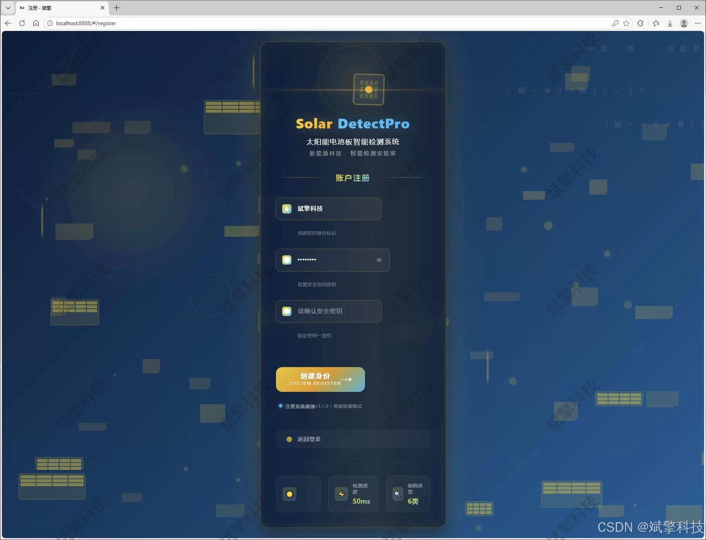
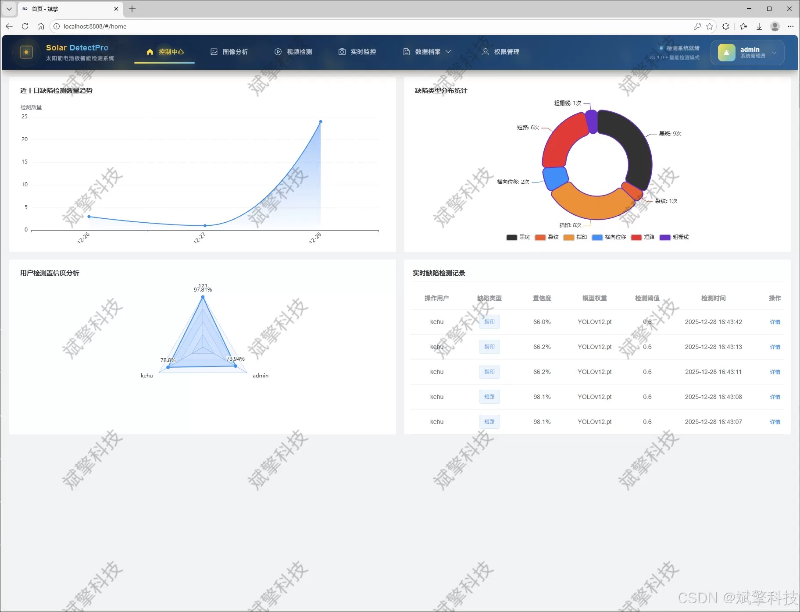
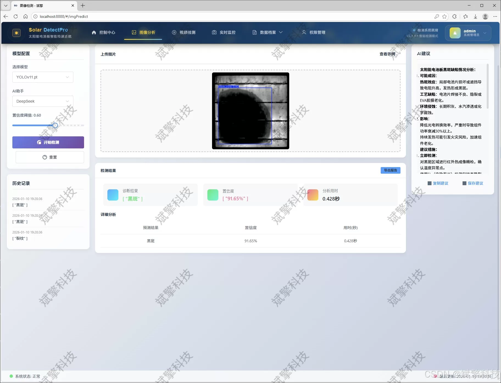
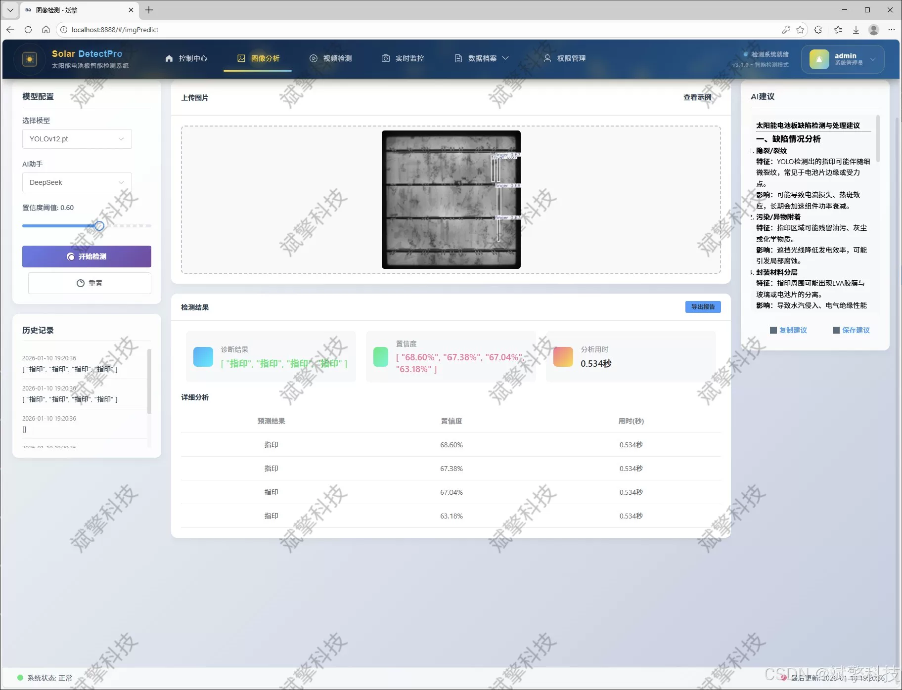
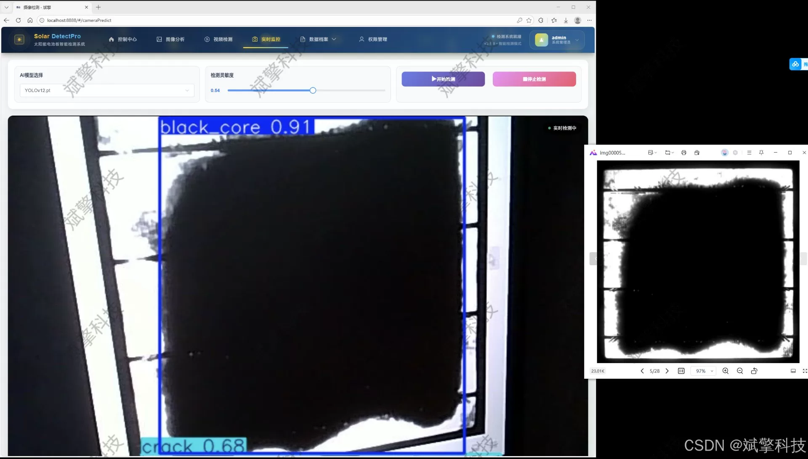
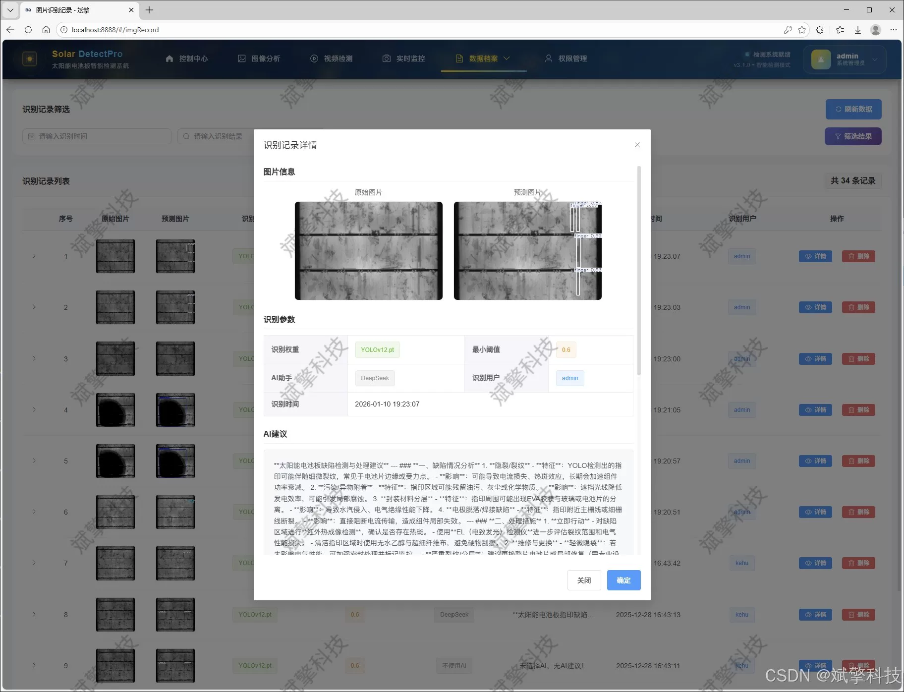
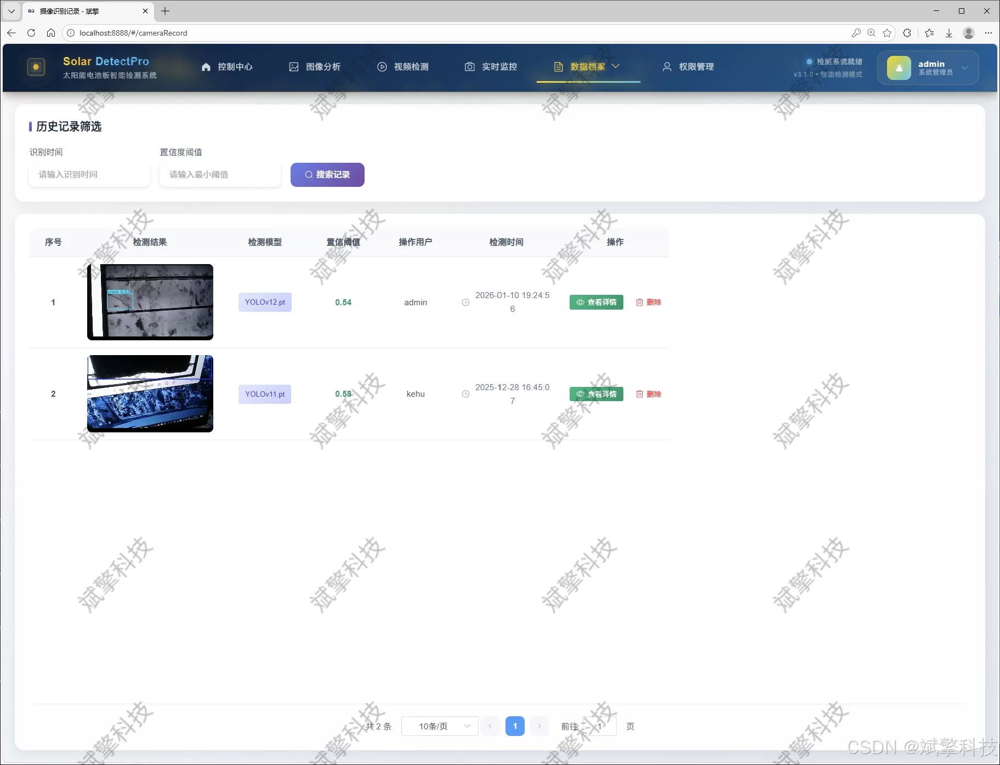
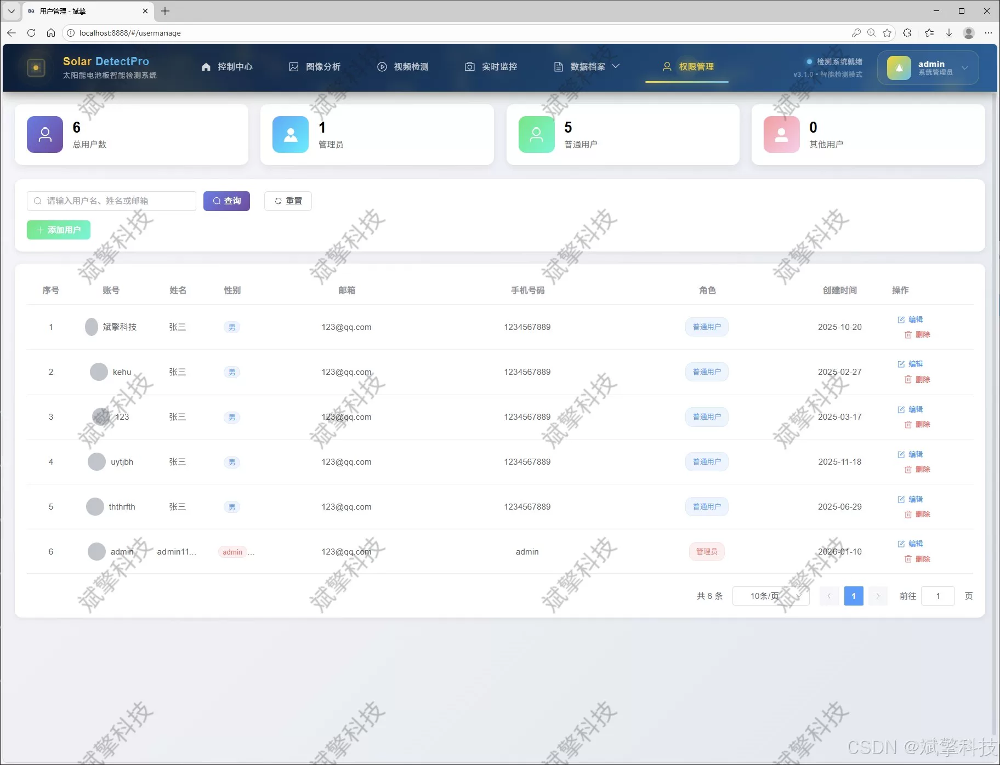
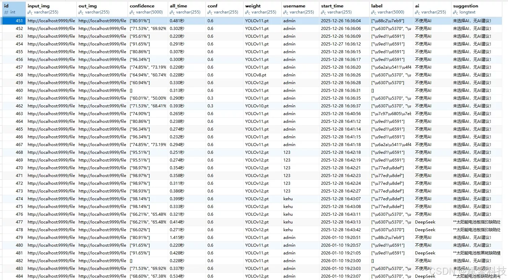

# YOLO+DeepSeek Photovoltaic Defect Detection System

## Body

The YOLO+DeepSeek photovoltaic defect detection system is based on the YOLO deep learning and the large models of Qianwen and DeepSeek for the solar cell panel defect detection system (DeepSeek intelligent analysis + web interaction interface + front-end and back-end separation + YOLO data + YOLOv8/YOLOv10/YOLOv11/YOLOv12).

With the rapid development of the photovoltaic industry, the large-scale deployment of solar panels has put forward an urgent need for efficient and accurate defect detection technology. Traditional manual inspection methods are inefficient, subjective, and costly. This paper designs and implements a smart detection and analysis system for solar panel defects based on deep learning and Web technology.

This system adopts a front-end and back-end separation architecture. The backend is centered around the SpringBoot framework, responsible for business logic, user management, and data persistence, using MySQL to store user information and detection records. The front end provides an interactive Web interface, implementing data visualization and management functions. The core detection module of the system integrates and supports four advanced YOLO series target detection algorithms: YOLOv8, YOLOv10, YOLOv11, and YOLOv12. It is specifically designed to train and optimize on a professional dataset containing six common defects: black_core (black core), crack (crack), finger (fingering), horizontal_dislocation (horizontal dislocation), short_circuit (short circuit), and thick_line (thick line), totaling 5016 images. The system offers three detection modes: image detection, video detection, and real-time camera detection. It can also structurely save the detection results (including defect type, location, confidence level, and image).

To further enhance the level of intelligence of the system, this system innovatively integrates the DeepSeek large language model to perform semantic analysis and summary on AI detection results, generating easy-to-understand defect reports. In addition, the system also realizes complete user authentication, permission management (administrators and ordinary users), personal center and multi-dimensional detection record management functions.

Functional module

✅ Information Visualization, Data Visualization.

✅ Image detection supports AI analysis functions, deepseek and Qianwen.

✅ Supports image detection, video detection, and real-time camera detection. The results are saved to a MySQL database.

✅ Picture recognition record management, video recognition record management and camera recognition record management.

✅ User Management Module, administrators can add, delete, modify, and query users.

✅ Personal center, can modify their own information, password name profile picture and so on.

There is no Lunwen writing service, nor any Lunwen.

## Images

## Payment

Here is a pay link on Stripe ( https://buy.stripe.com/3cs8yP7sY87d0vu9AB ). Please contact me lonlonago@foxmail.com after funding $89, and I will send you a complete data files , thank you!

